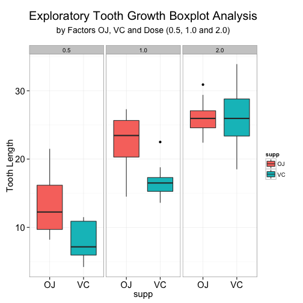

Statistical Inference Course Project
=====================================
### Student: Cary C
### Date:    October 24, 2014

This is the project for the statistical inference class.  
There are two parts to this project.  
In part 1 we will use simulation to explore inference and do some simple inferential data analysis.  
In part 2 we will use basic inferential data analysis and explore some Tooth Growth data.


## Part 1-Simulation Exercises
### 1-1.0 simulate rexp(0.2) a total of 40,000...this will be the raw datasource

```r
set.seed(1984)
datasource<-0
for (i in 1:40000){
  datasource[i]<-rexp(1,0.2)
  }
```
### 1-2.0 divide the raw datasource into 40 groups with about 1000 readings per group.  Then compute the averages

```r
splitter<-rep(1:1000,40)
group<-split(datasource, splitter)
normal<-lapply(group, FUN=mean); normal<-data.frame(unlist(normal))
```
### 1-3.0 Plot the raw datasource and confirm the shape is exponential(0.2)

```r
hist(datasource)
```

 
#### Fig 3.0 shows our original datasource as an exponential with lambda set to 0.2
### 1-3.1  Plot the distribution of averages for our 40 exponentials

```r
library(ggplot2)
# First setup some normal data points - we will use this to overlay on top of our histogram
h<-hist(normal$unlist.normal)
```

 
#### Fig 3.1a show the Histogram of the Distribution of Averages

### Fig 3.1b show the Histogram of the Distribution of Averages

```r
# Second step we will setup the plot for our formatted Distribution of Averages
ggplot(normal, aes(x=normal$unlist.normal)) +
        geom_histogram(binwidth=0.5, color='dark grey', fill='light pink') +
        geom_vline(xintercept=mean(normal$unlist.normal), color="dark red", lwd=1.5)+
        geom_line(aes(x=normal2$xfit, y=normal2$yfit), col="light blue", lwd=1.5)+
        theme_bw()+
        ggtitle(expression(atop("Distribution of Averages for 40 Exponential(0.2)", 
                                atop("with Mean(Red) and Normal Curve(Light Blue)"),""))) +
        theme(plot.title=element_text(size=20))+
        labs(x="Average Values", y="Frequency")+
        theme(axis.text.x=element_text(size=15))+
        theme(axis.text.y=element_text(size=15))+
        theme(axis.title.x=element_text(size=15))+
        theme(axis.title.y=element_text(size=15))
```

 
#### Fig 3.1c shows the Histogram of the Distribution of Averages, Mean and super-imposed Normal Curve
### Part 1 Conclusions

```r
# Sections 6.0 to 9.0 show the calculations for our conclusions
# 6.0 mean of the distributon
meanval<-mean(normal$unlist.normal)
# 7.0 sd of the distribution
s.dev<-sd(normal$unlist.normal)
# 8.0 actual std dev is 5...but with this subset....we should have 5/sqrt(subgroups)
s.dev.calc<-5/sqrt(40)
# 9.0 calculate the CI interval for the mean
CI<- meanval +c(-1,1)*qnorm(0.975)*s.dev/sqrt(length(normal$unlist.normal))
```
### Distribution Centering Analysis
#### Figure 3.1c shows the average value for the means is centered around 4.98 which is very close to the actual mean; 1/lamba = 5.00

### Variability Analysis 
#### The variance of the actual sample is 1/lambda which is again 5.0
#### However when taking the averages the standard deviation for the sdev's will be equal to (sdev for the population / Number of groups)
#### The ideal standard deviation should be 0.791 which corresponds to the actual sdev calculated from the averages which is 0.783

### Normal Analysis
#### Figure 3.1c shows the histogram of the measured averages with a superimposed Normal Curve on top.  From the curve we can notice that the histogram is approximately normal because of the following observations:
- the histogram is symmetrical around the mean of 5.0
- the normal curve fits nicely through the histogram
- a quick calculation shows that the histogram has almost all of its point within +/- 3.0 standard deviations

### Confidence Interval Coverage
#### The confidence interval for Xbar +/-1.96*s/n^0.5 is calculated as 4.9328, 5.0298; there is 95% confidence that when you draw a sample from the population that it's sample mean will be within this CI value.

#### We will use simulation to evaluate the coverage of the confidence interval 1/lambda.  We want to explore the range between 4 and 6 with simulated means=our calculated mean with our calculated sdev and simulated CI's for each run.  Each meanvalue was simulated 1000 times  and then we counted the percentage of time that the mean was within our calculated confidence interval.  Lastly we plot the coverage vs meanvalues and inspect the plot to ensure that the mean's are above the 95% CI threshold.

```r
n<-50
meanvalues<-seq(4.0, 6.0, by=0.05)
nosim<-1000
coverage<-sapply(meanvalues, function(meanval){
        mean.calc<-rnorm(nosim, mean=meanval, sd=s.dev)
        Il<-mean.calc-qnorm(0.975)*s.dev/sqrt(length(n))
        ul<-mean.calc+qnorm(0.975)*s.dev/sqrt(length(n))
        mean(Il < meanval & ul > meanval)
})
plot(coverage~meanvalues, type="l", ylim=c(.5,1.00), main="Coverage vs MeanValues") 
abline(a=NULL, b=0, h=0.95, v=NULL)
```

 
#### Figure of Coverage vs MeanValues
#### As we can see from the graph the calculated means are within the Confidence Intervals greater than 95% of the time

## Part 2-Basic Inferential Analysis on the ToothGrowth dataset
### 2-1.0 Load the ToothGrowth data and perform some basic exploratory data analyses

```r
data(ToothGrowth)
```
### The Data Summary

```r
data.summary<-data.frame(aggregate(len~supp + dose, 
            data=ToothGrowth, FUN=function(x) c(Average=mean(x), Median=median(x), Sdev=sd(x),  
                                                Min=min(x), Max=max(x), N=length(x))))
data.summary
```

```
##   supp dose len.Average len.Median len.Sdev len.Min len.Max  len.N
## 1   OJ  0.5      13.230     12.250    4.460   8.200  21.500 10.000
## 2   VC  0.5       7.980      7.150    2.747   4.200  11.500 10.000
## 3   OJ  1.0      22.700     23.450    3.911  14.500  27.300 10.000
## 4   VC  1.0      16.770     16.500    2.515  13.600  22.500 10.000
## 5   OJ  2.0      26.060     25.950    2.655  22.400  30.900 10.000
## 6   VC  2.0      26.140     25.950    4.798  18.500  33.900 10.000
```
#### Figure 2-1.1 Data Summary for ToothGrowth
### From Figure 2-1.1 we can see the following:
- ToothGrowth has N=60 points
- the points are divided up into 10 subgroups
- each subgroup is composed of two factors: supp= OJ or VC and dose = 0.5 or 1.0 or 2.0
- basic statistics are available in the chart

### Basic BoxPlots

```r
library(ggplot2)
ggplot(aes(x=supp, y=len), data=ToothGrowth)+
        geom_boxplot(aes(fill=supp))+
        theme_bw()+
        ggtitle(expression(atop("Exploratory Tooth Growth Boxplot Analysis",
                                atop("by Supp = OJ or VC"),"")))+
        theme(plot.title=element_text(size=20))+
        labs(x="supp", y="Tooth Length")+
        theme(axis.text.x=element_text(size=15))+
        theme(axis.text.y=element_text(size=15))+
        theme(axis.title.x=element_text(size=15))+
        theme(axis.title.y=element_text(size=15))
```

 
#### Figure 2-1.2 Tooth Length vs Supp (OJ or VC)
#### Preliminary analysis shows that OJ and VC seem to have very little difference between the two with respect to toothgrowth

```r
ggplot(aes(x=factor(dose), y=len), data=ToothGrowth)+
        geom_boxplot(aes(fill=factor(dose)))+
        theme_bw()+
        ggtitle(expression(atop("Exploratory Tooth Growth Boxplot Analysis",
                                atop("by Dose 0.5, 1.0, 2.0"),"")))+
        theme(plot.title=element_text(size=20))+
        labs(x="dose", y="Tooth Length")+
        theme(axis.text.x=element_text(size=15))+
        theme(axis.text.y=element_text(size=15))+
        theme(axis.title.x=element_text(size=15))+
        theme(axis.title.y=element_text(size=15))
```

 
#### Figure 2-1.3 Tooth Length vs Dose (0.5, 1.0, 2.0)
#### Preliminary analysis shows that Tooth Length does seem to very with respect to doseage.  As doseage increases so does Tooth length.


```r
ggplot(ToothGrowth, aes(y=len, x=supp))+
        geom_boxplot(aes(fill=supp)) +
        facet_wrap(~dose)+
        theme_bw()+
        ggtitle(expression(atop("Exploratory Tooth Growth Boxplot Analysis",
                                atop("by Factors OJ, VC and Dose (0.5, 1.0 and 2.0)"),"")))+
        theme(plot.title=element_text(size=20))+
        labs(x="supp", y="Tooth Length")+
        theme(axis.text.x=element_text(size=15))+
        theme(axis.text.y=element_text(size=15))+
        theme(axis.title.x=element_text(size=15))+
        theme(axis.title.y=element_text(size=15))
```

 
#### Figure 2-1.4 Tooth Length vs Supp and Dose
#### Preliminary analysis shows that we still have Tooth Length varying with dose but we can also see that at dose 2.0.0 that the OJ and VC subsamples have little variability. 

### 2-3.0 Confidence Intervals and Tests
#### In this section we will attempt to calculate whether the variance we see in the graphs are statistically significant or not.
#### There will be 7 total tests based on what we saw with the basic graph;  note: code is shown below but we will summarize in table with our conclusions
- Test 1:  Tooth Length by OJ or VC
- Test 2:  Tooth Length by Dose: 0.5 vs 1.0
- Test 3:  Tooth Length by Dose: 0.5 vs 2.0
- Test 4:  Tooth Length by Dose: 1.0 vs 2.0
- Test 5:  Tooth Length by OJ or VC for Dose =0.5
- Test 6:  Tooth Length by OJ or VC for Dose =1.0
- Test 7:  Tooth Length by OJ or VC for Dose =2.0


```
## Warning: some row.names duplicated: 2,3,4,5,6,7 --> row.names NOT
## used
```

```r
df
```

```
##             Test Name   P-Value Lower CI Upper CI rejectHo
## 1            OJ vs VC   0.06063   -0.171    7.571       No
## 2     Dose 0.5 vs 1.0 1.268e-07  -11.984   -6.276      Yes
## 3     Dose 0.5 vs 2.0 4.398e-14  -18.156  -12.834      Yes
## 4     Dose 1.0 vs 2.0 1.906e-05   -8.996   -3.734      Yes
## 5 OJ vs VC @ Dose 0.5  0.006359    1.719    8.781      Yes
## 6 OJ vs VC @ Dose 1.0  0.001038    2.802    9.058      Yes
## 7 OJ vs VC @ Dose 2.0    0.9639   -3.798    3.638       No
```

```r
df.result
```

```
##                 tests
## 1            OJ vs VC
## 2     Dose 0.5 vs 1.0
## 3     Dose 0.5 vs 2.0
## 4     Dose 1.0 vs 2.0
## 5 OJ vs VC @ Dose 0.5
## 6 OJ vs VC @ Dose 1.0
## 7 OJ vs VC @ Dose 2.0
##                                                        Conclusion
## 1            There is no significant difference between  OJ vs VC
## 2      There is a significant difference between  Dose 0.5 vs 1.0
## 3      There is a significant difference between  Dose 0.5 vs 2.0
## 4      There is a significant difference between  Dose 1.0 vs 2.0
## 5  There is a significant difference between  OJ vs VC @ Dose 0.5
## 6  There is a significant difference between  OJ vs VC @ Dose 1.0
## 7 There is no significant difference between  OJ vs VC @ Dose 2.0
```
#### Figure 2-1.5 Table Summary for all 7 T-Tests

### From Figure 2-1.5 we see see the following from our testing:
- when 0 is between the lower CI and upper CI we cannot reject Ho and can conclude that there is a significant difference in the factors
- this is also confirmed when the p-value is less than our p-cutoff (5% in this case)

### Conclusions:
#### If you ignore dose then there is no significant difference between supp = OJ or VC:
- this corresponds to Test 1 and we suspected there was no difference by looking at Figure 2-1.2
- note that the p-value>0.5 and that 0 was captured between lower CI and upper CI

#### If you ignore supp then as Dose varies from 0.5 - 2.0 there is a significant impact on Tooth Growth.  Higher doses = Longer teeth
- this outcome corresponds to Tests 2-4; from Figure 2-1.3 we can see the +ve impact that dose has on tooth growth
- note that the p-values <0.5 and that 0 is not captured between lower CI and upper CI

#### When you look at both supp and dose there is a significant difference but only when dose=0.5 or 1.0 not at 2.0
- this outcome corresponds to Test 5-7; from Figure 2-1.4 we can see that there is no difference between OJ & VC at dose = 2.0
- the shift in Tooth length at Dose 2.0 is most probably due to the sole influence of the high dose
- OJ at doses at 0.5 or 1.0 has a higher impact on tooth growth than VC

### Assumptions:
- We will assume that there was no biased sampling with respect to the selection of test subjects-> random sampling is preferred
- We will assume that accurate measurements were taken and that equipment was calibrated and not switched out between measures
- We may assume that other Factors didn't play into the data ie: size, age or health of subjects could affect the results as well
- T Tests were set with paired = False because the samples must be independent as test subjects can't be tested with different protocols
- T Tests were set with var.equal=F because we assume that the populations of test subjects were different

## Appendix
### Code for T Tests and Confidence Intervals

```r
#3.0 Use confidence intervals and hypothesis tests to compare tooth growth by supp and dose
#3.1 Test by Supplement (supp: OJ vs VC)
supptt<-t.test(len~supp, paired=FALSE, var.equal=F, data=ToothGrowth)

#Test by Dose (dose 0.5 vs 1, dose 0.5 vs 2.0 and dose 1.0 vs 2.0)
#3.2 a) Test by Dose (dose 0.5 vs 1)
Dose_dot5_to_1<-subset(ToothGrowth, dose %in% c(0.5,1.0))
dosepart1     <-t.test(len~dose, paired=FALSE, var.equal=F, data=Dose_dot5_to_1)

#3.2 b) Test by Dose (dose 0.5 vs 2.0)
Dose_dot5_to_2<-subset(ToothGrowth, dose %in% c(0.5, 2.0))
dosepart2     <-t.test(len~dose, paired=FALSE, var.equal=F, data=Dose_dot5_to_2)

#3.2 c) Test by Dose (dose 1.0 vs 2.0)
Dose_1_to_2<-subset(ToothGrowth, dose %in% c(1.0, 2.0))
dosepart3  <-t.test(len~dose, paired=FALSE, var.equal=F, data=Dose_1_to_2)

#3.3 a) Test by Supp across Dose; Test OJ vs VS for Dose 0.5
Dose_dot5  <-subset(ToothGrowth, dose==0.5)
suppbydose5<-t.test(len~supp, paired=FALSE, var.equal=F, data=Dose_dot5)


#3.3 b) Test by Supp across Dose; Test OJ vs VS for Dose 0.5
Dose_1_0   <-subset(ToothGrowth, dose==1.0)
suppbydose1<-t.test(len~supp, paired=FALSE, var.equal=F, data=Dose_1_0 )


#3.3 a) Test by Supp across Dose; Test OJ vs VS for Dose 0.5
Dose_2_0   <-subset(ToothGrowth, dose==2.0)
suppbydose2<-t.test(len~supp, paired=FALSE, var.equal=F, data=Dose_2_0)
tests<-cbind(c('OJ vs VC', 
               'Dose 0.5 vs 1.0', 'Dose 0.5 vs 2.0', 'Dose 1.0 vs 2.0',
               'OJ vs VC @ Dose 0.5', 'OJ vs VC @ Dose 1.0', 'OJ vs VC @ Dose 2.0'))
tests_name<-"Test Name"
pvalue<-cbind(c(supptt[3],
                dosepart1[3], dosepart2[3], dosepart3[3],
                suppbydose5[3], suppbydose1[3], suppbydose2[3]))
pvalue<-as.data.frame(pvalue)
pvalue_name<-"P-Value"
conf.int.lo<-cbind(c(supptt$conf.int[1],
                  dosepart1$conf.int[1], dosepart2$conf.int[1], dosepart3$conf.int[1],
                  suppbydose5$conf.int[1], suppbydose1$conf.int[1], suppbydose2$conf.int[1]))
conf.int.lo_name<-"Lower CI"
conf.int.hi<-cbind(c(supptt$conf.int[2],
                     dosepart1$conf.int[2], dosepart2$conf.int[2], dosepart3$conf.int[2],
                     suppbydose5$conf.int[2], suppbydose1$conf.int[2], suppbydose2$conf.int[2]))
conf.int.hi_name<-"Upper CI"
df<-data.frame(tests, pvalue, conf.int.lo, conf.int.hi)
```

```
## Warning: some row.names duplicated: 2,3,4,5,6,7 --> row.names NOT
## used
```

```r
colnames(df)<-c(tests_name, pvalue_name,conf.int.lo_name, conf.int.hi_name)
df$rejectHo<-c("No", "Yes", "Yes", "Yes", "Yes", "Yes", "No")

#4.0 State your conclusions and the assumptions needed for your conclusions.
accept<-"There is no significant difference between "
reject<-"There is a significant difference between "
df.result<-data.frame(tests)
df.result$Conclusion<-ifelse(df$rejectHo=="No", paste(accept, df$'Test Name'), paste(reject, df$'Test Name'))
```

```r
df
```

```
##             Test Name   P-Value Lower CI Upper CI rejectHo
## 1            OJ vs VC   0.06063   -0.171    7.571       No
## 2     Dose 0.5 vs 1.0 1.268e-07  -11.984   -6.276      Yes
## 3     Dose 0.5 vs 2.0 4.398e-14  -18.156  -12.834      Yes
## 4     Dose 1.0 vs 2.0 1.906e-05   -8.996   -3.734      Yes
## 5 OJ vs VC @ Dose 0.5  0.006359    1.719    8.781      Yes
## 6 OJ vs VC @ Dose 1.0  0.001038    2.802    9.058      Yes
## 7 OJ vs VC @ Dose 2.0    0.9639   -3.798    3.638       No
```

```r
df.result
```

```
##                 tests
## 1            OJ vs VC
## 2     Dose 0.5 vs 1.0
## 3     Dose 0.5 vs 2.0
## 4     Dose 1.0 vs 2.0
## 5 OJ vs VC @ Dose 0.5
## 6 OJ vs VC @ Dose 1.0
## 7 OJ vs VC @ Dose 2.0
##                                                        Conclusion
## 1            There is no significant difference between  OJ vs VC
## 2      There is a significant difference between  Dose 0.5 vs 1.0
## 3      There is a significant difference between  Dose 0.5 vs 2.0
## 4      There is a significant difference between  Dose 1.0 vs 2.0
## 5  There is a significant difference between  OJ vs VC @ Dose 0.5
## 6  There is a significant difference between  OJ vs VC @ Dose 1.0
## 7 There is no significant difference between  OJ vs VC @ Dose 2.0
```


